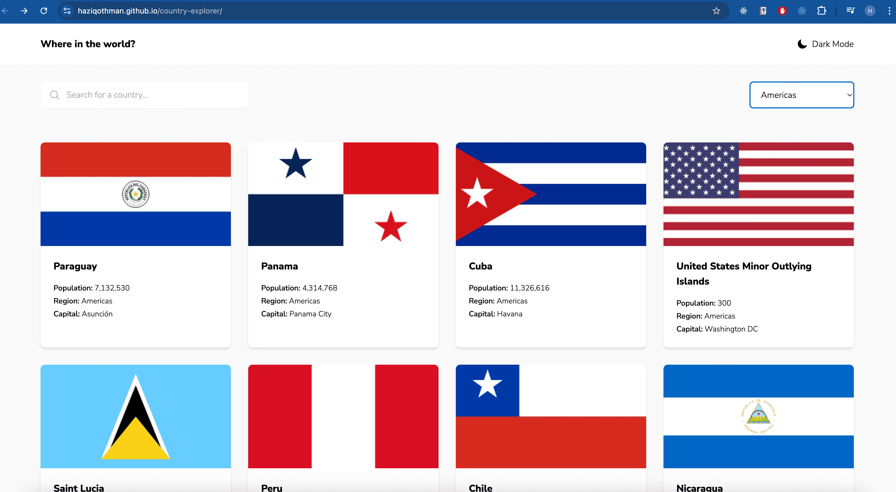

## Project Setup

```sh
yarn install
```

### Compile and Hot-Reload for Development

```sh
yarn dev
```

### Compile and Minify for Production

```sh
yarn build
```

### Localhost URL

```sh
 http://localhost:5173/
```


### Live URL

```sh
https://haziqothman.github.io/country-explorer/
```

### Screenshots



